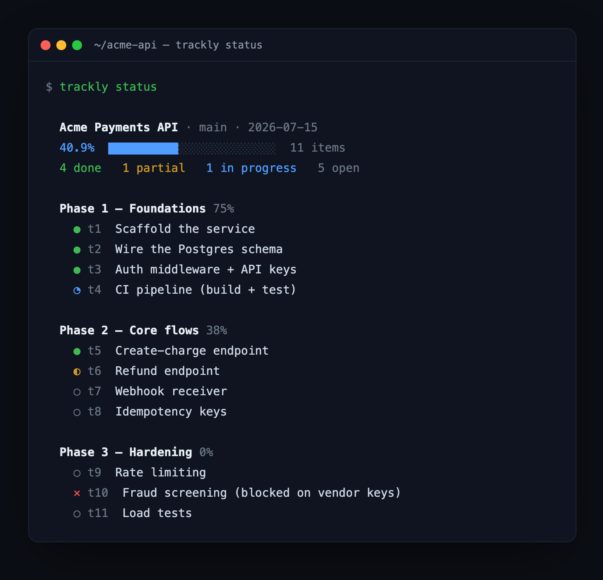
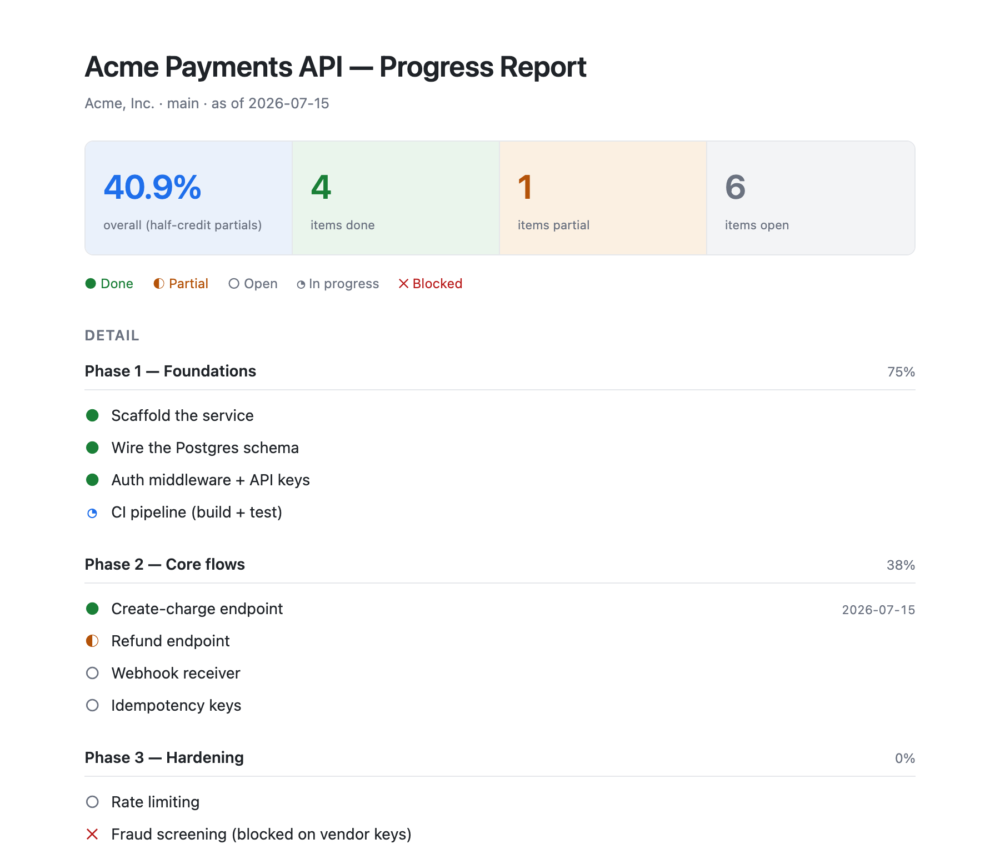

# Trackly

**Agent-native progress tracking that lives in a repo like git.**

Trackly rides alongside a coding agent (Claude Code, Cursor, Aider, …). The moment
the agent forms a plan, it hands that plan to Trackly; as the agent works, it marks
tasks done. Trackly measures weighted completion and turns it into a terminal
scoreboard and a printable progress report.

No nagging, no daemon. Trackly is silent until you (or the agent) call it — exactly
like git is silent until you commit.

```
agent forms plan  ──▶  Trackly records it        (source of truth)
agent does a task ──▶  Trackly marks it done     (execution state)
you run report    ──▶  Trackly renders a PDF     (the deliverable)
```

## See it

`trackly status` — the terminal scoreboard, grouped by phase:

<p align="center">
  
</p>

`trackly report` — a print-ready HTML document (→ Save as PDF):

<p align="center">
  
</p>

---

## Why

Most repos already contain a plan — `plan.md`, `tasks.md`, `goals.md`, an agent's
todo list. What's missing is a way to **measure** how far along it is and **show**
that to someone. Trackly reads the plan, tracks execution against it, and produces a
clean report you can hand to a stakeholder.

Because it snapshots state every time it's touched, Trackly also builds a history of
*when* things got done — reconstructing the progress timeline from the work itself.

## Install

Trackly is a single native binary. **End users never need Rust installed.**

**One-line install** (macOS / Linux) — downloads the latest prebuilt binary:

```sh
curl -fsSL https://raw.githubusercontent.com/vehutech/trackly/main/scripts/install.sh | sh
```

**Manual download** — grab the archive for your platform from the
[latest release](https://github.com/vehutech/trackly/releases/latest), unpack it, and
put `trackly` on your PATH. Prebuilt targets:

| Platform | Asset |
|---|---|
| macOS (Apple Silicon) | `trackly-<ver>-aarch64-apple-darwin.tar.gz` |
| macOS (Intel) | `trackly-<ver>-x86_64-apple-darwin.tar.gz` |
| Linux (x86_64) | `trackly-<ver>-x86_64-unknown-linux-gnu.tar.gz` |
| Windows (x86_64) | `trackly-<ver>-x86_64-pc-windows-msvc.zip` |

**From source** (requires the Rust toolchain):

```sh
git clone https://github.com/vehutech/trackly
cd trackly
cargo build --release -p trackly-cli
# binary at target/release/trackly — put it on your PATH
```

## Quickstart

```sh
cd your-repo
trackly init          # creates .trackly/, seeding a plan from plan.md/tasks.md/… if present
trackly status        # see the scoreboard
trackly report        # write trackly-report.html → open it, Print → Save as PDF
```

If no plan doc is found, `init` tells you how to add one.

## How an agent uses it

An agent that can run shell commands can drive Trackly directly. Two patterns:

**Push the whole plan at once** (markdown checklist or JSON, from a file or stdin):

```sh
# from a markdown checklist
trackly plan set plan.md

# from JSON, piped in
echo '{
  "title": "Payments Service",
  "tasks": [
    {"title": "Card charge endpoint", "group": "Phase 2", "status": "done"},
    {"title": "Refund endpoint",      "group": "Phase 2", "status": "partial"},
    {"title": "Reconciliation report","group": "Phase 3", "weight": 3}
  ]
}' | trackly plan set -
```

**Update tasks as work lands:**

```sh
trackly task start t4
trackly task done  t4 --evidence "abc1234 implemented charge endpoint"
trackly task partial t5
trackly task block   t7 --evidence "waiting on vendor API keys"
```

## Command reference

| Command | What it does |
|---|---|
| `trackly init` | Create `.trackly/`, seeding a plan from an existing doc if one is found. |
| `trackly plan set <file\|->` | Replace the plan from a markdown checklist or JSON (`-` = stdin). |
| `trackly plan add "<title>" [--group G] [--weight W]` | Append one task. |
| `trackly task done\|partial\|start\|block\|open <id> [--evidence <note>]` | Change a task's status. |
| `trackly status` | Print the terminal scoreboard (%, done/partial/open, by group). |
| `trackly report [--out FILE] [--subtitle "Org"]` | Write a print-ready HTML report. |

## Native agent integration (MCP)

Shelling out to the CLI works with any agent. For a first-class integration, Trackly
also ships an **MCP server** (`trackly-mcp`) — installed alongside the CLI — that agents
like Claude Code, Cursor, and Windsurf connect to and call natively.

Add it to **Claude Code**:

```sh
claude mcp add trackly -- trackly-mcp
```

…or drop a `.mcp.json` in your project root (works for Claude Code and, with the same
shape, other MCP clients):

```json
{
  "mcpServers": {
    "trackly": { "command": "trackly-mcp" }
  }
}
```

The server operates on the current working directory (or `$TRACKLY_REPO`) and exposes
these tools:

| Tool | Purpose |
|---|---|
| `set_plan` | Record the plan (title + tasks) — call it once a plan is formed. |
| `add_task` | Append a single task. |
| `update_task` | Set a task's status (`done`/`partial`/…), with optional evidence. |
| `get_status` | Return the current scoreboard as text. |
| `generate_report` | Write the HTML progress report and return its path. |

Now the agent hands over its plan the moment it forms one, and marks tasks as it works —
no shell calls, no reminders.

## Plan format

Trackly reads ordinary markdown checklists — nothing new to learn:

```markdown
# Payments Service

## Phase 1 — Foundations
- [x] Scaffold the service      ← done
- [/] Set up CI                 ← in progress
- [ ] Write the docs            ← open

## Phase 2 — Core flows
- [~] Webhook receiver          ← partial (half credit)
- [-] Fraud check               ← blocked
```

`#` → report title · `##`/`###` → groups · list items → tasks. Checkbox marks:
`[x]` done, `[ ]` open, `[/]` in progress, `[~]` partial, `[-]` blocked.

## Scoring

Completion is **line-weighted with half-credit partials**:

```
percent = Σ(credit(task) × weight) / Σ(weight) × 100
credit:  done = 1.0   partial = 0.5   open/in-progress/blocked = 0
```

Every task defaults to weight 1; bump `--weight` for larger items. Treat the % as a
rough directional signal, not a precise measure of effort.

## What's stored

Trackly keeps a `.trackly/` directory in your repo, mirroring how `.git/` sits there:

- `.trackly/plan.json` — the current plan (source of truth)
- `.trackly/history.jsonl` — an append-only snapshot per change (the trend over time)

Both are human-readable. Commit them if you want the plan and its history versioned.

## Updating & versioning

Trackly follows [semantic versioning](https://semver.org). Releases are cut by pushing
a `vX.Y.Z` git tag, which builds and publishes the cross-platform binaries automatically.

**Updating the CLI** — pick whichever matches how you installed:

```sh
# installed via the one-liner? just re-run it — it fetches the latest release
curl -fsSL https://raw.githubusercontent.com/vehutech/trackly/main/scripts/install.sh | sh

# built from source? pull and rebuild
git pull && cargo build --release -p trackly-cli
```

Check what you're on with `trackly --version`, and see the newest release on the
[releases page](https://github.com/vehutech/trackly/releases). The `.trackly/` store
format is forward-compatible within a major version, so upgrading never breaks an
existing plan.

*Planned:* a built-in `trackly self-update` (download + swap the binary in place) and a
Homebrew tap so `brew upgrade trackly` works.

**Auto-updating the desktop app** — the planned Tauri app will ship with Tauri's
[updater plugin](https://tauri.app/plugin/updater/), which is the standard mechanism for
this: on launch it checks a release feed (GitHub Releases), and if a newer, **signed**
build exists it downloads and applies it, prompting the user first. Updates are verified
against a public key baked into the app, so a tampered update is rejected. This is how a
native app updates itself without the user ever touching a terminal — the CLI's story is
"re-run the installer / `brew upgrade`," the desktop's is "it updates itself, verified."

## Architecture

A Rust workspace so one engine backs every surface:

- **`crates/trackly-core`** — the plan model, store, scoring, markdown parsing, and
  HTML report renderer. UI-agnostic.
- **`crates/trackly-cli`** — the `trackly` command.
- **`crates/trackly-mcp`** — the `trackly-mcp` MCP server (agent integration).
- **`src-tauri` + `src`** — the future desktop app (see roadmap).

Both the CLI and the MCP server are thin shells over `trackly-core` — one engine, three
front doors.

## Roadmap

- **Done — the `trackly` CLI**: plan capture, status, HTML/PDF report.
- **Done — prebuilt binaries**: cross-platform releases + one-line installer, zero Rust.
- **Done — MCP server**: agents call `set_plan` / `update_task` natively.
- **Next — git as evidence**: an opt-in post-commit hook that auto-snapshots and links
  commit hashes/dates to tasks.
- **Next — Homebrew tap + `trackly self-update`** for effortless CLI upgrades.
- **Later — the "like GitHub" desktop app**: the Tauri app becomes a machine-wide view
  that discovers all your Trackly repos, shows dashboards, and exports reports.

## License

MIT.
